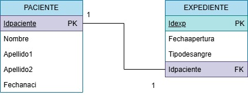
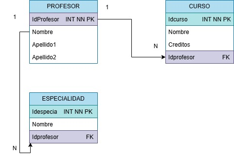
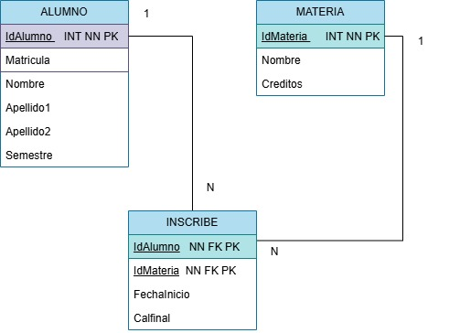
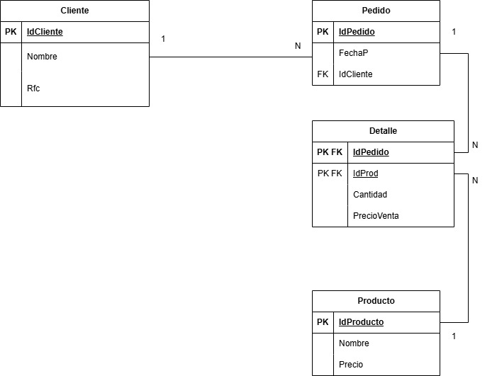
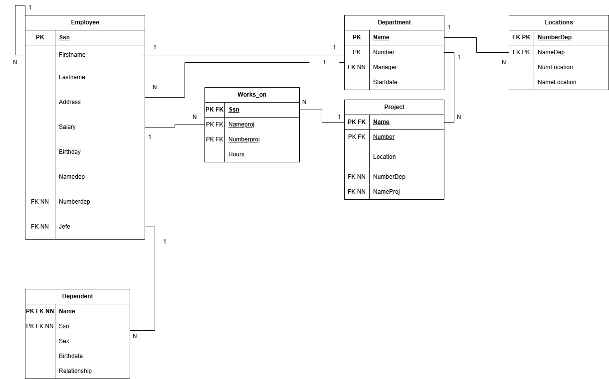
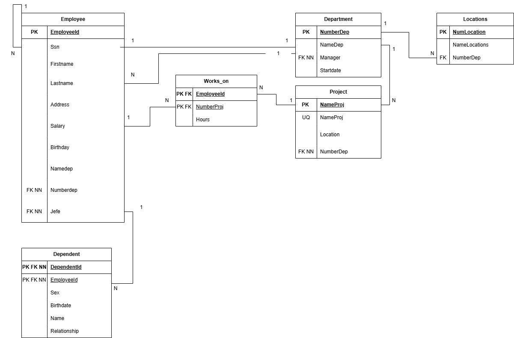
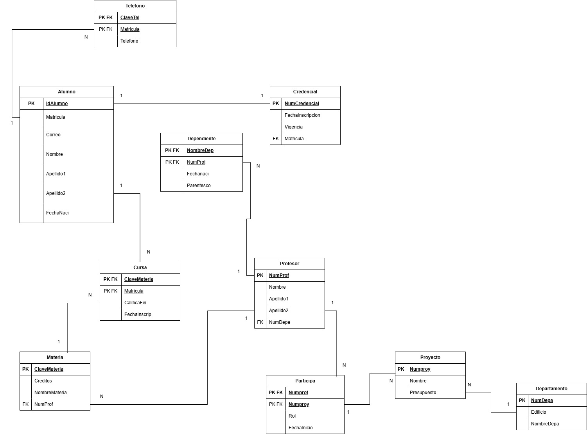

# Ejercicios del modelo Relacional

# 1. Ejercicio 1 HOSPITAL
## Modelo E-R

## Modelo Relacional

# 2. Ejercicio 2 UNIVERSIDAD
## Modelo E-R

## Modelo Relacional

# 3. Ejercicio 3 ESCUELA
## Modelo E-R

## Modelo Relacional

# 4. Ejercicio 4 EMPRESA
## Modelo E-R

## Modelo Relacional

# 5. Ejercicio 5 COMPANY
## Modelo E-R

## Modelo Relacional

# 6. Ejercicio 6 COMPANY Version 2
## Modelo E-R

## Modelo Relacional

# 7. Ejercicio 7 ESCUELA
## Modelo E-R

## Modelo Relacional
