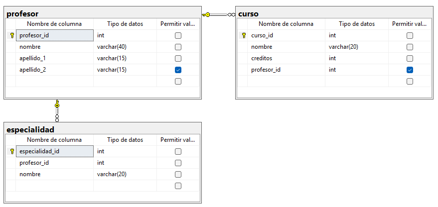

``` sql

-- crear base de datos

CREATE DATABASE escuela;
GO

-- usar la base de datos
USE escuela;
GO

-- tabla profesor

CREATE TABLE profesor (
	profesor_id INT NOT NULL,
	nombre VARCHAR (40) NOT NULL,
	apellido_1 VARCHAR(15) NOT NULL,
	apellido_2 VARCHAR(15),

	CONSTRAINT pk_profesor
	PRIMARY KEY (profesor_id)
);
GO

--tabla curso

CREATE TABLE curso(
	curso_id INT NOT NULL,
	nombre VARCHAR(20) NOT NULL,
	creditos INT NOT NULL,
	profesor_id INT,

	CONSTRAINT pk_curso
	PRIMARY KEY (curso_id),
	CONSTRAINT ck_curso_creditos
	CHECK(creditos>0),
	CONSTRAINT fk_curso_profesor
	FOREIGN KEY (profesor_id)
	REFERENCES profesor(profesor_id)
);
GO

-- tabla especialidad
CREATE TABLE especialidad (
	especialidad_id INT NOT NULL,
	profesor_id INT NOT NULL,
	nombre VARCHAR(20) NOT NULL,

	CONSTRAINT pk_especialidad
	PRIMARY KEY (especialidad_id),
	CONSTRAINT fk_especialidad_profesor
	FOREIGN KEY (profesor_id)
	REFERENCES profesor(profesor_id)
);
GO
```

## DIAGRAMA FINAL

