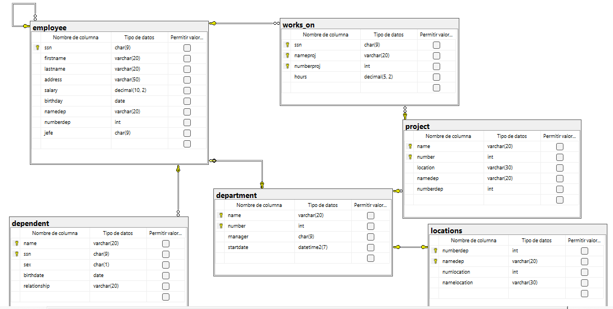

``` sql

-- CREAR LA BASE DE DATOS
CREATE DATABASE company;
GO

-- USAR LA BASE DE DATOS
USE company;
GO

-- TABLA EMPLOYEE
CREATE TABLE employee (
    ssn CHAR(9) NOT NULL,
    firstname VARCHAR(20) NOT NULL,
    lastname VARCHAR(20) NOT NULL,
    address VARCHAR(50) NOT NULL,
    salary DECIMAL(10,2) NOT NULL,
    birthday DATE NOT NULL,
    namedep VARCHAR(20) NOT NULL,
    numberdep INT NOT NULL,
    jefe CHAR(9) NOT NULL, -- foreign key recursiva o jerarquica

    CONSTRAINT pk_employee
    PRIMARY KEY (ssn),
    CONSTRAINT ck_employee_salary
    CHECK (salary > 0),
    CONSTRAINT fk_employee_employee
    FOREIGN KEY (jefe)
    REFERENCES employee (ssn)
);
GO

-- TABLA DEPARTMENT
CREATE TABLE department (
    name VARCHAR(20) NOT NULL,
    number INT NOT NULL IDENTITY(1,1),
    manager CHAR(9) NOT NULL,
    startdate DATETIME2 NOT NULL
    CONSTRAINT df_department_startdate
    DEFAULT SYSDATETIME(),

    CONSTRAINT pk_department
    PRIMARY KEY (name, number),
    CONSTRAINT fk_department_employee
    FOREIGN KEY (manager)
    REFERENCES employee (ssn)
);
GO

-- AGREGAR LA FOREIGN KEY COMPUESTA DE EMPLOYEE HACIA DEPARTMENT
ALTER TABLE employee
ADD CONSTRAINT fk_employee_department
FOREIGN KEY (namedep, numberdep)
REFERENCES department (name, number);
GO

-- TABLA LOCATIONS
CREATE TABLE locations (
    numberdep INT NOT NULL,
    namedep VARCHAR(20) NOT NULL,
    numlocation INT NOT NULL,
    namelocation VARCHAR(30) NOT NULL,

    CONSTRAINT pk_locations
    PRIMARY KEY (numberdep, namedep),
    CONSTRAINT fk_locations_department
    FOREIGN KEY (namedep, numberdep)
    REFERENCES department (name, number)
);
GO

-- TABLA PROJECT
CREATE TABLE project (
    name VARCHAR(20) NOT NULL,
    number INT NOT NULL IDENTITY(1,1),
    location VARCHAR(30) NOT NULL,
    namedep VARCHAR(20) NOT NULL,
    numberdep INT NOT NULL,

    CONSTRAINT pk_project
    PRIMARY KEY (name, number),
    CONSTRAINT fk_project_department
    FOREIGN KEY (namedep, numberdep)
    REFERENCES department (name, number)
);
GO

-- TABLA WORKS_ON
CREATE TABLE works_on (
    ssn CHAR(9) NOT NULL,
    nameproj VARCHAR(20) NOT NULL,
    numberproj INT NOT NULL,
    hours DECIMAL(5,2) NOT NULL
    CONSTRAINT ck_works_on_hours
    CHECK (hours > 0),

    CONSTRAINT pk_works_on
    PRIMARY KEY (ssn, nameproj, numberproj),
    CONSTRAINT fk_works_on_employee
    FOREIGN KEY (ssn)
    REFERENCES employee (ssn),
    CONSTRAINT fk_works_on_project
    FOREIGN KEY (nameproj, numberproj)
    REFERENCES project (name, number)
);
GO

-- TABLA DEPENDENT (entidad debil: llave parcial "name" + ssn del empleado)
CREATE TABLE dependent (
    name VARCHAR(20) NOT NULL,
    ssn CHAR(9) NOT NULL,
    sex CHAR(1) NOT NULL
    CONSTRAINT ck_dependent_sex
    CHECK (sex IN ('M','F')),
    birthdate DATE NOT NULL,
    relationship VARCHAR(20) NOT NULL,

    CONSTRAINT pk_dependent
    PRIMARY KEY (name, ssn),
    CONSTRAINT fk_dependent_employee
    FOREIGN KEY (ssn)
    REFERENCES employee (ssn)
);
GO
```
## DIAGRAMA FINAL
