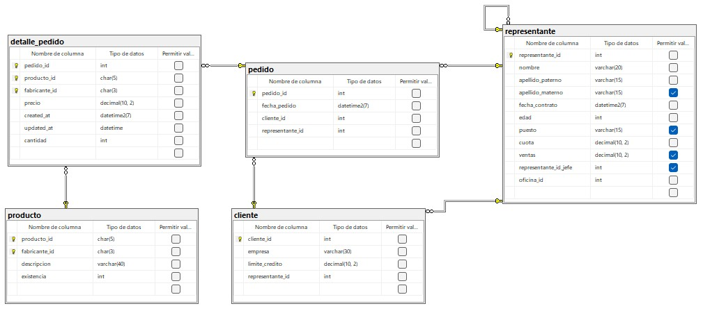

```sql

-- CREAR LA BASE DE DATOS
CREATE DATABASE comercializadora;
GO

-- USAR LA BASE DE DATOS
USE comercializadora;
GO

-- TABLA PRODUCTO
CREATE TABLE producto (
    producto_id CHAR(5) NOT NULL,
    fabricante_id CHAR(3) NOT NULL,
    descripcion VARCHAR (40) NOT NULL,
    existencia INT NOT NULL,
    CONSTRAINT pk_producto
    PRIMARY KEY (producto_id, fabricante_id),
    CONSTRAINT uq_producto_descripcion
    UNIQUE (descripcion),
    CONSTRAINT ck_producto_existencia
    CHECK (existencia>0)
);
GO

-- TABLA CLIENTE

CREATE TABLE cliente (
    cliente_id INT NOT NULL IDENTITY(1,1)
    CONSTRAINT pk_cliente
    PRIMARY KEY,
    empresa VARCHAR (30) NOT NULL
    CONSTRAINT uq_cliente_empresa
    UNIQUE,
    limite_credito DECIMAL(10,2) NOT NULL
    CONSTRAINT ck_cliente_limite_credito
    CHECK (limite_credito BETWEEN 10000 AND 100000),
    representante_id INT NOT NULL
);
GO

-- TABLA REPRESENTANTE

CREATE TABLE representante(
    representante_id INT NOT NULL IDENTITY(1,1),
    nombre VARCHAR(20) NOT NULL,
    apellido_paterno VARCHAR(15) NOT NULL,
    apellido_materno VARCHAR (15),
    fecha_contrato DATETIME2 NOT NULL
    CONSTRAINT df_representante_fecha_contrato
    DEFAULT SYSDATETIME(),
    edad INT NOT NULL,
    puesto VARCHAR (15),
    cuota DECIMAL (10,2) NOT NULL,
    ventas DECIMAL (10,2),
    representante_id_jefe INT, -- foreing key recursiva o jerarquica
    oficina_id INT NOT NULL, -- foreign key de representante
    CONSTRAINT pk_representante
    PRIMARY KEY (representante_id),
    CONSTRAINT ck_representante_edad
    CHECK (edad>=18 AND edad<=55),
    CONSTRAINT ck_representante_cuota
    CHECK (cuota>0.0),
    CONSTRAINT ck_representante_venta
    CHECK (ventas>=0.0),
    CONSTRAINT fk_representante_representante
    FOREIGN KEY (representante_id_jefe)
    REFERENCES REPRESENTANTE (representante_id)
);

-- TABLA PEDIDOS
CREATE TABLE pedido (
    pedido_id INT NOT NULL IDENTITY (1,1)
    CONSTRAINT pk_pedido
    PRIMARY KEY,
    fecha_pedido DATETIME2 NOT NULL
    CONSTRAINT df_pedido_fecha_pedido
    DEFAULT SYSDATETIME(),
    cliente_id INT NOT NULL
    CONSTRAINT fk_pedido_cliente
    FOREIGN KEY (cliente_id)
    REFERENCES cliente(cliente_id),
    representante_id INT NOT NULL
    CONSTRAINT fk_pedido_representante
    FOREIGN KEY (representante_id)
    REFERENCES representante (representante_id)
);
GO

-- AGREGAR LA FOREIGN KEY A LA TABLA CLIENTE QUE VIENE DE REPRESENTANTE
ALTER TABLE cliente
ADD CONSTRAINT fk_cliente_representante
FOREIGN KEY (representante_id)
REFERENCES representante(representante_id);
GO


-- CREAR TABLA DETALLE PEDIDO

CREATE TABLE detalle_pedido(
     pedido_id INT NOT NULL,
     producto_id CHAR (5) NOT NULL,
     fabricante_id CHAR(3) NOT NULL,
     precio DECIMAL (10,2) NOT NULL,
     created_at DATETIME2 NOT NULL
     CONSTRAINT df_detalle_pedido_created_at
     DEFAULT SYSDATETIME(),
     updated_at DATETIME NOT NULL
     CONSTRAINT df_detalle_pedido_updated_at
     DEFAULT SYSDATETIME(),
     CONSTRAINT ck_detalle_pedido_precio
     CHECK (precio>0.0),
     cantidad INT NOT NULL
     CONSTRAINT ck_detalle_pedido_cantidad
     CHECK(cantidad>0.0),
     PRIMARY KEY (pedido_id,producto_id,fabricante_id),
     CONSTRAINT fk_detalle_pedido_pedido
     FOREIGN KEY (pedido_id) -- foreign key de pedido
     REFERENCES pedido(pedido_id),
     CONSTRAINT fk_references_pedido_producto
     FOREIGN KEY (producto_id, fabricante_id)
     REFERENCES producto(producto_id, fabricante_id)

);
GO

```

## DIAGRAMA FINAL


